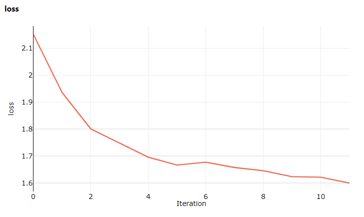

Azure ML は、（少なくとも！）2つの方法で ML のワークロードに対して特別な燃料供給をすることができます:

- AML Compute: より大きなモデルの学習を行うためのパワフルな計算リソースを提供
- Run history: クラス最高の系列と再現性

この記事では、 Run History に焦点を当てます。そしてそれが生活必需品となる理由にも着目します！

チームが何十回、ひいては何百回と実験を行うようになると、それらを整理するための何らかの方法が不可欠になります。 Run History は、ML モデルの構築にとってすぐさまに欠かせないものとなる多くの機能を提供するサービスです。

### Experiment と Run

複数の異なるプロジェクトで数十もの実験を行っている場合、結果を整理して検索するための明確な方法が重要となります。 Azure ML は、これを支援する2つの概念を提供しています。 `Run` (実行) と `Experiment` (実験) です。

#### Run
Run とは、コードの1回の実行であり、通常は学習用スクリプトです。 Run にはライフサイクルがあります。コードは Azure ML に送信するよう準備され（例えば ScriptRunConfig を介して）、それから送信されます。

一度コードが Azure ML に送信されると（例えば、 `ScriptRunConfig` を介して）、 `Run` オブジェクトが作成されます。ターゲットとなる Compute が準備され（ノードがプロビジョニングされ、 Python 環境をホストするコンテナが起動します）、エントリポイントのスクリプトが呼び出され（ `$ python run.py [args]` ）、以下の様にログの生成が開始されます:

```console
Files already downloaded and verified
epoch=1, batch= 2000: loss 2.19
epoch=1, batch= 4000: loss 1.82
epoch=1, batch= 6000: loss 1.66
...
```

`run.log('<metric_name>', metric_value)` を使用して Azure ML にメトリックを記録し、 Azure ML Studio で監視することができます:



学習は終了し、通常はいくつかのモデルファイルが保存され、ノードが解放されます。

しかし、話はそれだけでは終わりません。ノードが Azure に返却された後も、 Run は持続します。実行の履歴、すべての出力とメトリック、およびそれらを生成するために使用された正確なコードを確認するために、コード内または Azure ML Studio 経由でいつでも戻ることができます。

#### Experiment

Experiment とは Run の集合体です。すべての Run は1つの Experiment に属します。通常、 Experiment は例えば「Bert-Large の微調整」といった特定の作業項目に関連付けられており、この目標に向かって反復することで、多数の Run を保有することになります。

### スナップショット

Azure ML で実行するコードを送信すると、 _スナップショット_ が取得されます。これは、実行されたコードの正確なコピーです。これは、 Experiment のバージョン管理と考えてください。2ヶ月前の Experiment の結果を再現したいと思っても、その間にモデルやトレーニングスクリプトを繰り返し変更していたとしたら？問題ありません。スナップショットがカバーしてくれます！

`.amlignore` ファイルを使えば、スナップショットに何を入れるかを完全にコントロールできます。これは `.gitignore` と同じ役割を果たすもので、スナップショットに含めるものを効率的に管理できます。

### メトリック

実験を行う際には、検証の損失からGPUの負荷まで、各種メトリックを追跡します。これらのメトリックを分析することは、最適なモデルを決定するのに不可欠です。 Run History を使うことで、これらのメトリックが全ての Run に対して保存されます。